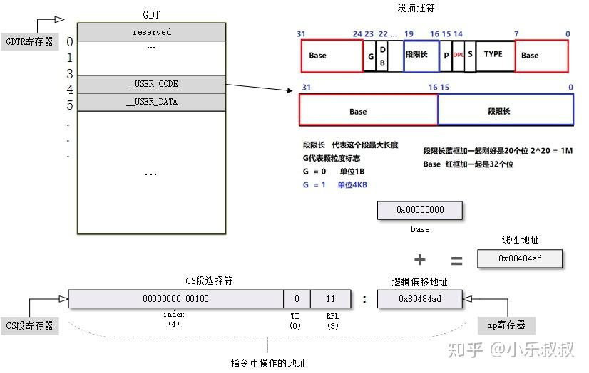

# 操作系统的作用

## 五大作用
    1、管理进程：内核负责创建和销毁进程, 并处理它们与外部世界的联系(输入和输出)，不同进程间通讯

    (通过信号，管道，或者进程间通讯原语)对整个系统功能来说是基本的，也由内核处理。 另外， 调度器， 控制进程如何共享CPU，是进程管理的一部分。更通常地，内核的进程管理活动实现了多个进程在一个单个或者几个CPU 之上的抽象。

    2、管理内存：计算机的内存是主要的资源， 处理它所用的策略对系统性能是至关重要的。内核为所有进程的每一个都在有限的可用资源上建立了一个虚拟地址空间。内核的不同部分与内存管理子系统通过一套函数调用交互，从简单的malloc/free对到更多更复杂的功能。

    3、文件系统：Unix 在很大程度上基于文件系统的概念;几乎Unix中的任何东西都可看作一个文件。内核在非结构化的硬件之上建立了一个结构化的文件系统，结果是文件的抽象非常多地在整个系统中应用。另外，Linux 支持多个文件系统类型，就是说，物理介质上不同的数据组织方式。例如，磁盘可被格式化成标准Linux的ext3文件系统，普遍使用的FAT文件系统，或者其他几个文件系统。

    4、设备控制：几乎每个系统操作终都映射到一个物理设备上，除了处理器，内存和非常少的别的实体之外，全部中的任何设备控制操作都由特定于要寻址的设备相关的代码来进行。这些代码称为设备驱动。内核中必须嵌入系统中出现的每个外设的驱动，从硬盘驱动到键盘和磁带驱动器。内核功能的这个方面是本书中的我们主要感兴趣的地方。

    5、网络管理：网络必须由操作系统来管理，因为大部分网络操作不是特定于某一个进程： 进入系统的报文是异步事件。报文在某一个进程接手之前必须被收集，识别，分发，系统负责在程序和网络接口之间递送数据报文，它必须根据程序的网络活动来控制程序的执行。另外，所有的路由和地址解析
    问题都在内核中实现。

原文:https://zhuanlan.zhihu.com/p/506655032

通俗点来说，操作系统内核就是用来作资源的控制，权限的限制，协调软硬件。

# 操作系统分层
    操作系统层级（X86 64架构下）分为Ring 0 1 2 3，Ring3也就是我们的用户层，Ring0就是我们的内核层，其中还有一个非正式的说法Ring -1层，也就是我们所说的硬件层，层级呢，数字越小权限越大，权限越大，所能做的事情越多。站在内核层的程序(驱动)如果想要杀死用户层是降维打击的。

## 操作系统分层的实现 保护模式(略)

    关键点:cs ss eip/rip esp/rsp
    其中cs和ss是段寄存器,寄存器寻址CS:EIP SS:ESP

    图片转载 https://zhuanlan.zhihu.com/p/324210723 作者:小乐叔叔

    简单说明一下cs段寄存器，CS段寄存器长度16位(32位操作系统下)，其中低2位是表示RPL也就是请求权限等级，三环就是3，0环就是0。第3bit，表示去哪里找段描述符，0表示GDT(全局描述符)，1表示LDT(局部描述符)，找到对应的描述符后，截取Base部分和EIP指向部分相加，得到最终地址

### 为什么只需要cs ss eip/rip esp/rsp ？
#### CPU的基本调度单位是？
#### 线程本质？

